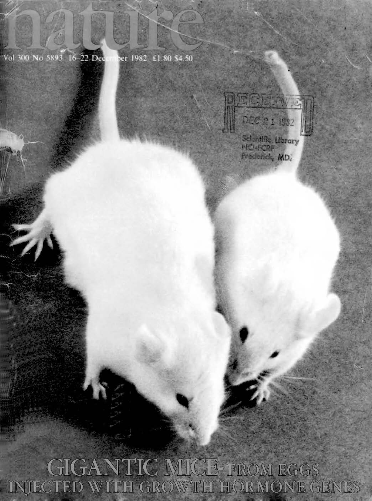
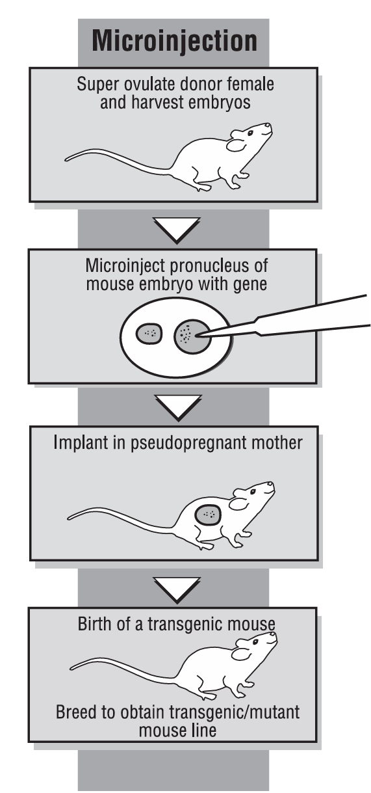
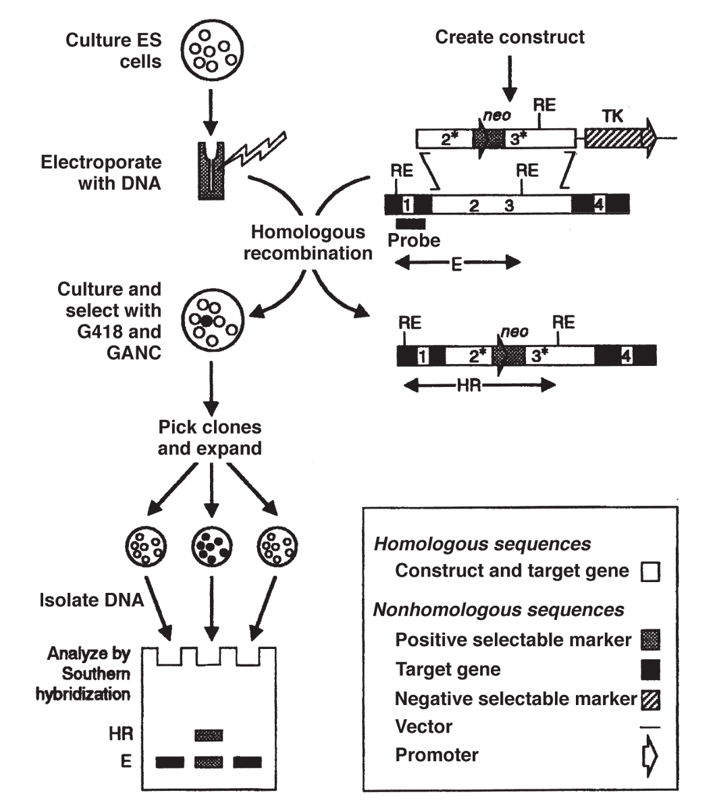
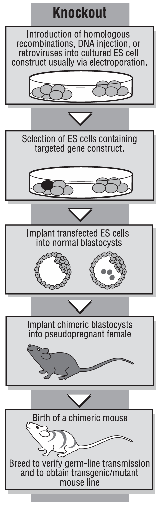
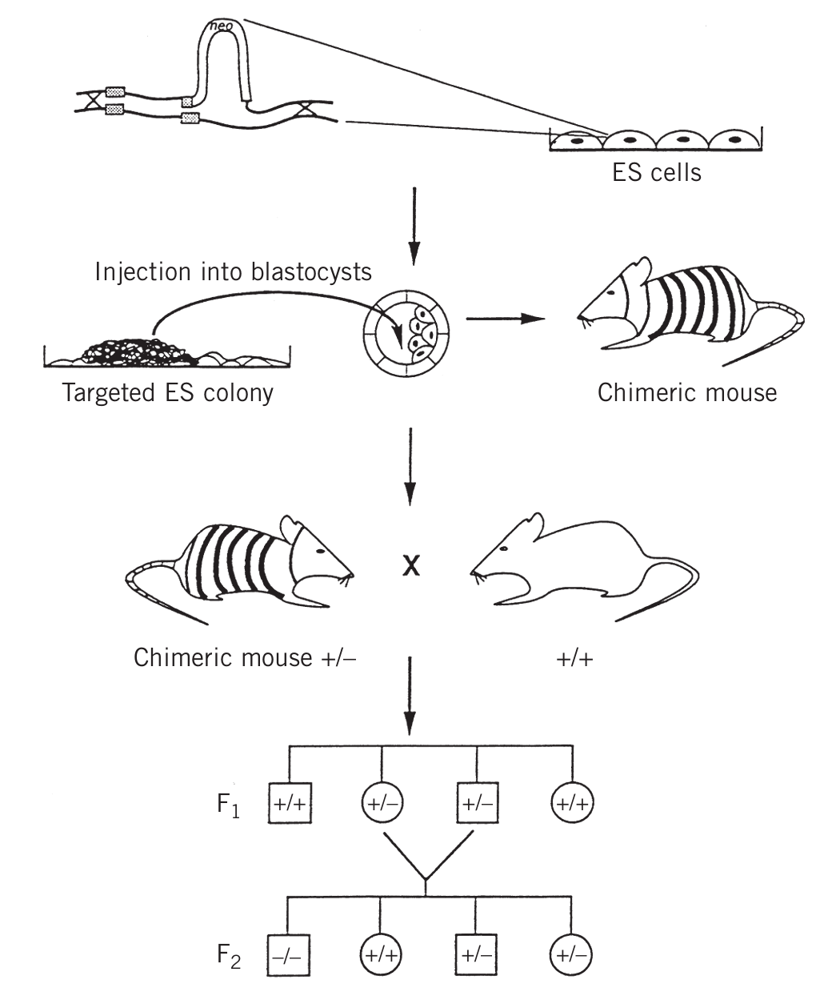
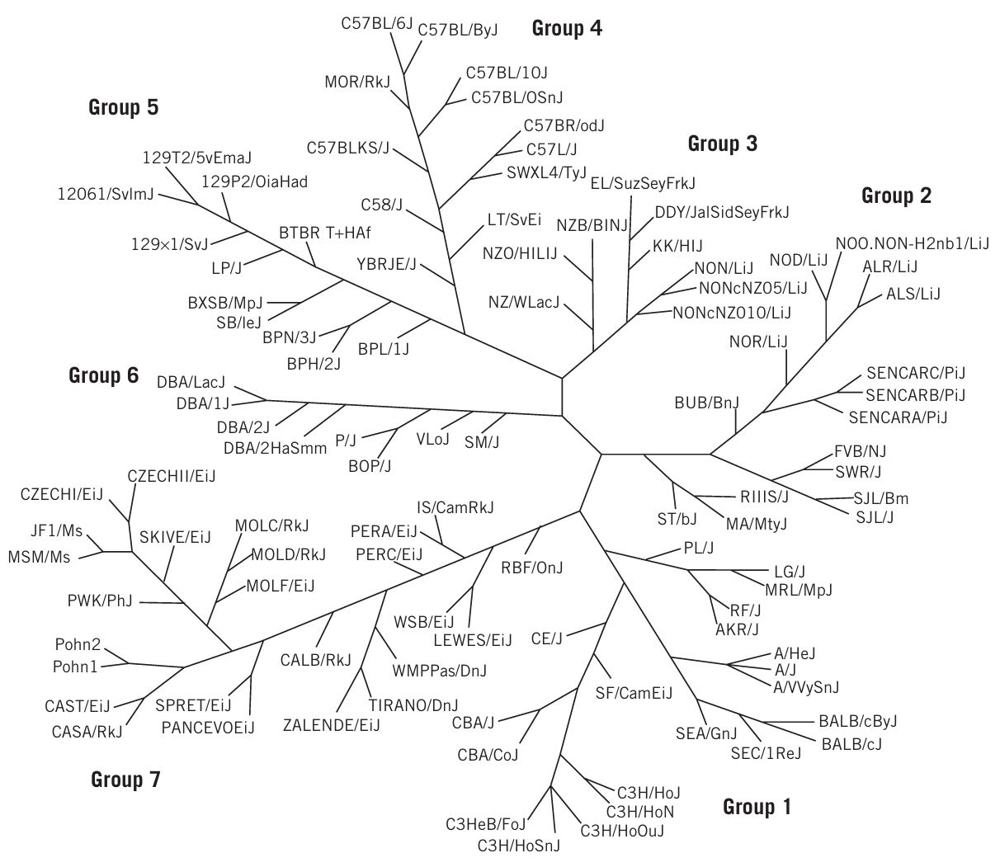
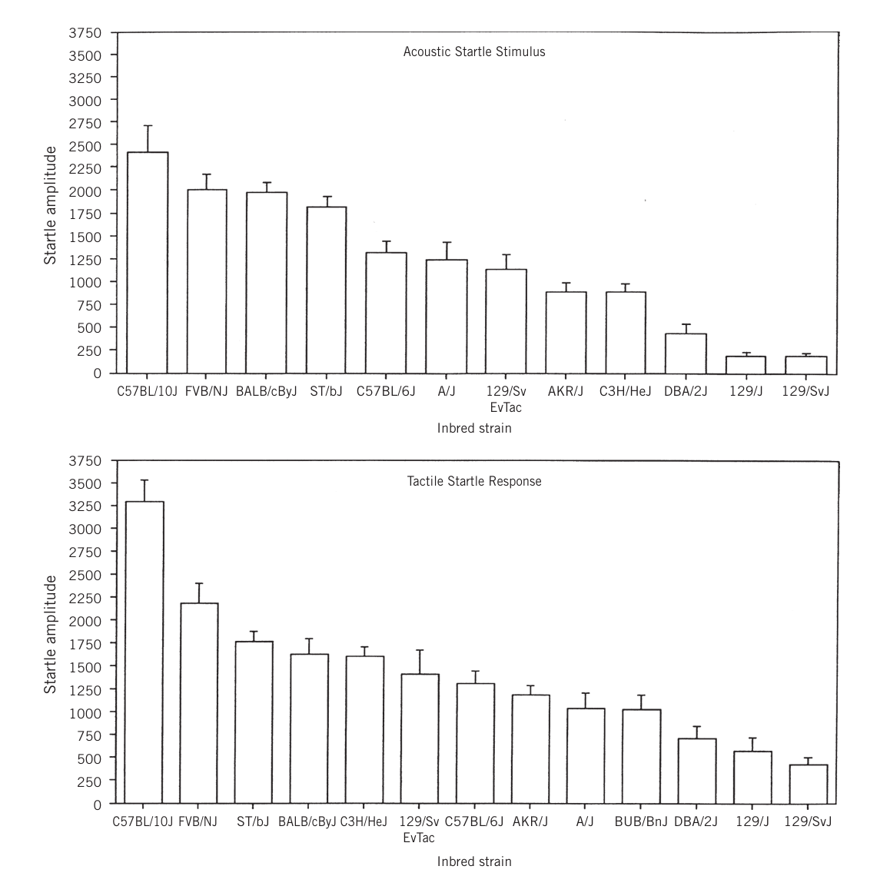
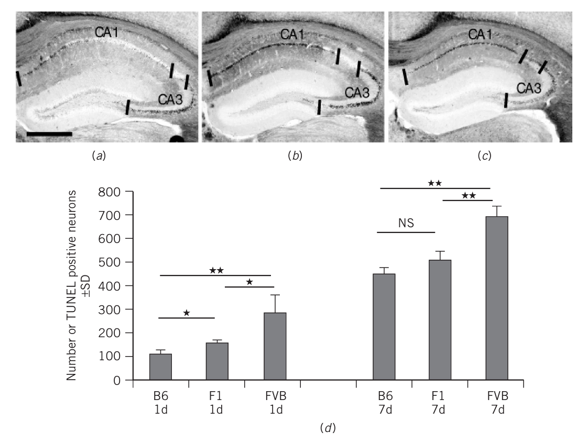
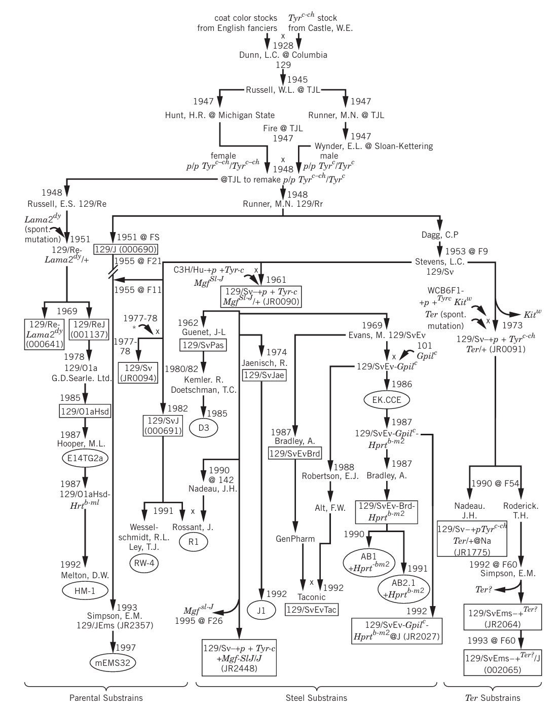

# 独角兽与奇美拉

{fig-alt="转基因小鼠体型对比" fig-align="center"}

---

靶向基因突变技术始于20世纪80年代（Jaenisch, 1976, 1988; Costantini and Lacy, 1981; Gordon and Ruddle, 1981; Harbers et al., 1981; Wagner et al., 1981a, 1981b; Jaenisch, 1988; Pascoe et al., 1992; Doetschman, 1991; Smithies, 1993; Bronson and Smithies, 1994; Smithies and Kim, 1994; Capecchi, 1989, 1994）。在对酵母和果蝇基因组进行操作的基础上，小鼠突变体大量涌现。1982年，在转基因小鼠中检测到与行为相关的表型的首次重大成功出现。12月16日《Nature》杂志的封面插图（如对页所示）展现了Richard Palmiter及其华盛顿大学（University of Washington）的同事们进行的精妙实验的戏剧性结果，激发了大众的想象力（Palmiter et al., 1982）。一只过度表达生长激素的转基因小鼠，由于体重增长更快，其体型比同龄同性别的正常同窝对照小鼠大得多。哺乳动物靶向基因突变技术方面的进步，使人们燃起了希望，认为这项新技术可以应用于发现个体基因在正常和异常行为过程中的作用。在过去的十年中，这一梦想已变为现实。许多优秀的书籍和综述文章描述了生成转基因动物、基因敲除、基因敲入、条件性突变、诱导性突变以及其他精巧的基因组操作的技术（Bradley et al., 1992; Hogan et al., 1994; Accili, 2000; Joyner, 2000; Jackson, 2000; Gossmann et al., 2000; Rülicke and Hübscher, 2000; Nestler et al., 2001; Hofker et al., 2002; Nagy et al., 2002; Wolfer et al., 2002; Tecott and Wehner, 2001; Tecott, 2003; Tenenbaum et al., 2004）。

本章简要概述了当前使用的靶向基因突变类型。本章的主要焦点是首只奠基鼠（founder mouse）产生后的后续步骤。本文介绍了根据行为表型分析需求量身定制的育种策略。针对各种行为领域，推荐了已有效用于繁殖突变系（mutant lines）的背景品系（background strains）相关的饲养、运输，群体大小、群体构成和动物福利要求，以满足行为表型分析的特殊需求。正文中引用的原始文献以及本章末尾引用的综述文章，可为感兴趣的读者提供更深入的信息。本章末尾的列表包括关于DNA构建体、胚胎干细胞系、育种策略、小鼠手册、提供育种和基因分型服务的公司、设计和制造行为测试设备的公司，以及生成和分析突变小鼠表型的学术组织和公司。与这些主题相关的网站也包含在内。

## 生成靶向基因突变

开发转基因小鼠或基因敲除小鼠的过程始于一个已确定的基因。如果该基因尚未测序，则无法设计出有用的靶向载体。

*转基因*的定义是插入一个基因。转基因小鼠可能被添加了一个新基因，例如人类亨廷顿病（Huntington’s）的致病基因 (Carter et al., 1999)；也可能是现有基因的额外拷贝，例如促肾上腺皮质激素释放因子（corticotropin releasing factor）基因，以研究这种应激相关激素和神经递质的过表达 (Stenzel-Poore et al., 1994)。转基因技术涉及将含有转基因的DNA构建体显微注射到受精小鼠卵母细胞的原核中。该DNA构建体还包含一个带有核定位信号 (nls) 的报告基因，例如β-半乳糖苷酶 (lacZ)。报告基因由转基因的启动子同时驱动。LacZ阳性细胞表明细胞中存在转基因。通过测定报告基因、转基因和基因产物的浓度，来确定目的组织中基因的过表达水平。报告基因、转基因和基因产物的解剖学定位图谱被用于描述转基因在大脑中的分布，或更精确地界定在发育阶段表达已知基因产物的特定神经元 (Jacobowitz and Abbott, 1997; Itoh et al., 1998)。转基因方法如图2.1所示。每只由显微注射卵发育而成的小鼠都是一个潜在的突变品系创始者。该技术的成功率与注射的卵数量成正比，因为通过同源重组进行的插入是随机且不频繁的事件。你购买的彩票越多，中奖的机会就越大。

{fig-alt="产生转基因小鼠" fig-align="center"}

*基因敲除*小鼠代表功能丧失或无效突变，这意味着一个突变基因无法合成其蛋白质。基因敲除小鼠通过一套不同的技术产生 (Wynshaw-Boris et al., 1999; Ledermann, 2000)。与基因插入不同，基因敲除是在基因cDNA的一个精心选择的外显子中引入突变。这种突变通常是对DNA关键表达基因产物的片段进行选择性删除。一个抗生素耐药基因，例如新霉素抗性基因 (Neo^r^)，作为标记物被插入到DNA构建体中。这种删除和插入通常会改变DNA的阅读框，导致构成基因产物的氨基酸三联碱基对密码子被错误解读。一个典型的靶向载体如图2.2所示。

{fig-alt="同源重组" fig-align="center"}

靶向基因构建体被插入到胚胎干细胞 (ES细胞) 的基因组中。用于生成基因敲除小鼠的ES细胞系最常来源于129近交系小鼠。与其他小鼠品系或大鼠品系的ES细胞相比，几个129亚系的ES细胞在培养中生长良好，通过电穿孔和植入过程仍保持活力，并能定殖发育中胚胎的大部分 (Simpson et al., 1997)。基因敲除方法如图2.3所示。
    
{fig-alt="基因敲除小鼠" fig-align="center"}

成功进行基因敲除后诞生的第一只幼崽被称为*奇美拉* (chimera)[^1]，因为它含有来自两个独立来源的细胞。毛皮的外观可能是一个有用的早期成功突变标记。C57BL/6品系小鼠有黑色毛皮。129品系小鼠有野鼠色（浅灰褐色）毛皮。当幼崽的被毛颜色出现灰棕色，或有时呈现黑色和灰棕色斑块或条纹，嵌合体（奇美拉）在视觉上是显而易见的。如果在囊胚阶段没有 ES 细胞掺入，幼崽将呈现黑色被毛。基因分型 (Genotyping) 仍然是明确鉴定嵌合体（奇美拉）的必要方法。

## 始祖品系

如果掺入囊胚细胞中的突变发展成为生殖系配子（即卵子和精子），那么靶向突变就会遗传给嵌合体（奇美拉）后代的下一代。当掺入只发生在体细胞中时，发育成非生殖组织，则原始嵌合体（奇美拉）会表达该突变，但它们的后代不会。产生嵌合体（奇美拉）及其后代的方案显示在图 2.4 中。

{fig-alt="嵌合体小鼠" fig-align="center"}

为了检测生殖系传递，会进行一次回交测试。将该嵌合体（奇美拉）与正常近交系小鼠（例如 C57BL/6J）进行交配。回交测试的 F~1~ 代后代进行基因分型以检测突变的表达。接收到来自嵌合体祖代亲本的突变基因的 F~1~ 代后代，是该突变基因的杂合子。对一小块组织样本（通常取自后代尾部）进行Southern印迹分析或聚合酶链反应（polymerase chain reaction, PCR）检测，以鉴定阳性杂合子。每个阳性杂合子都可用于建立一系突变小鼠。鉴定的 F~1~ 代杂合子后代相互交配，以产生 F~2~ 代。理论上，F~2~ 代群体将遵循孟德尔分离定律，产生四分之一 (1/4) 的纯合突变体 (−/−)、二分之一 (2/4) 的杂合子 (+/−) 和四分之一 (1/4) 的纯合野生型对照 (+/+) 。如果该基因是致死的，则纯合子将无法存活。如果该基因位于X染色体或Y染色体上，则性别因素会影响每种基因型的雄性和雌性比例。 F~2~ 小鼠的基因型通过Southern印迹检测，以确定+/+小鼠中正常基因的存在、+/−小鼠中正常基因互补量的一半的存在以及−/−小鼠中基因的缺失。当基因产物已知时，基因产物的表达可通过适当的技术进行检测，例如通过 high-pressure liquid chromatography 检测酶或通过 radioimmunoassay 检测。杂合子 (+/−) 可能表达一半的基因产物，反映了半个基因剂量的存在，或者在某些情况下表达可变数量的基因产物。纯合突变小鼠 (−/−) 应不表达基因产物。这些经确认的 −/− 小鼠被称为*无效突变体*(null mutants)。图 2.5 阐述了确认突变的技术。

{fig-alt="确认 Sandhoff disease 的 hexosaminidase B 基因敲除小鼠模型中的突变" fig-align="center"}

传统的基因打靶技术如今在世界各地的实验室中广泛使用。提高特异性的改良方法正日益普及。组织特异性条件性突变使研究者能够将突变仅引入特定细胞类型中。条件性突变解决了两个问题：(1) 对转基因整合到染色体上的位点缺乏控制；(2) 敲除突变在全身的普遍性。将转基因与组织特异性启动子连接，可将整合位点限制在与特定启动子同源的染色体位点。将敲除与组织特异性启动子连接，可确保修饰后的 DNA 构建体仅在通常表达该启动子基因的组织中表达。例如，CaMKIIα启动子将靶向基因突变的区域特异性赋予前脑神经元（Mayford et al., 1996）。

利用噬菌体P1来源的Cre/loxP重组系统，开发了一种对海马CA1锥体细胞具有特异性的启动子（Tsien et al., 1996）。诱导性突变允许研究人员在所需的发育阶段或生命周期内开启和关闭突变（Mansuy and Bujard, 2000）。时间特异性由一个通过实时药物治疗激活或去激活的调控表达系统赋予。四环素控制反式激活因子（tetracycline-controlled transactivator）和反向四环素反式激活因子（reverse tetracycline transactivators）分别被多西环素（doxycycline）激活或去激活，多西环素是一种以低剂量通过饮用水给药的抗生素（Mansuy et al., 1998, 1999; Sakai et al., 2002）。他莫昔芬（tamoxifen）诱导的Cre-ERT重组酶是另一种可设计成具有组织特异性启动子的诱导剂（Weber et al., 2001）。

*敲入*（knock-in）突变是点突变，靶向基因中的单个核苷酸，从而在其蛋白质产物中产生单个氨基酸取代（Giese, 1999; Tecott and Wehner, 2001; Tecott, 2003）。基因的功能可能被改变，但不会被消除。这种改变可能导致功能丧失或功能获得。例如，GABA-A受体中的一个点突变，将α4和α6亚基第101位氨基酸的组氨酸替换为精氨酸，保留了GABA-A受体的大部分功能，但降低了其在转棒试验中对地西泮（diazepam）的敏感性（McKernan et al., 2000; Burt, 2003）。儿茶酚-O-甲基转移酶（catechol-O-methyl transferase）中的一个点突变，将第158位氨基酸从甲硫氨酸（methionine）转换为缬氨酸（valine），导致由背外侧前额叶皮层（dorsolateral prefrontal cortex）介导的执行功能受损，并似乎与精神分裂症（schizophrenia）有关（Egan et al., 2001; Blasi et al., 2005）。烟碱受体（nicotinic receptor）亚基的敲入研究正在阐明介导吸烟行为的受体亚基组成（Champtiaux and Changeaux, 2004）。在小鼠Hdh基因的正确背景下，具有延长多聚谷氨酰胺（polyglutamine）序列的敲入小鼠会表现出异常的活动水平，这可能反映了亨廷顿病（Huntington’s disease）的进展（Hickey and Chesselet, 2003）。

敲低（knockdown）突变包括通过更精确的解剖学特异性操纵基因表达的技术。如第14章所述的腺相关病毒（adeno-associated virus, AAV）等病毒载体被设计用于将特定基因直接递送至大脑区域（Hommel et al., 2003; Tenenbaum et al., 2004）。含有该基因的AAV悬浮液被微量注射到大脑区域。靶组织的稳定转染允许基因产物从该时间点开始仅在该组织中合成，从而避免了早期发育阶段，并赋予了微注射部位的解剖学特异性。例如，将抑制性神经肽（inhibitory neuropeptide）galanin基因通过AAV递送并微量注射到下丘（inferior colliculus）后，局灶性癫痫发作得到减弱（Haberman et al., 2003）。RNA干扰（RNAi）是一种新技术，如第14章所述，它能中和特定的基因序列以关闭表达（Hommel et al., 2003; Lavery and King, 2003）。单一沉默RNA序列（single silencer RNA sequences, siRNA）、siRNA文库以及使用siRNA转染剂或siRNA表达载体的递送系统均有市售（例如，Ambion Inc., www.ambion.com; Qiagen, www.qiagen.com; Stratagene, www.stratagene.com）。表达靶向酪氨酸羟化酶（tyrosine hydroxylase）特定基因序列以及增强型绿色荧光蛋白（enhanced green fluorescent protein）的shRNAs的病毒被微量注射到小鼠中脑（midbrain）中（Hommel et al., 2003）。例如，荧光免疫染色（fluorescent immunostaining）显示，荧光蛋白特异性地存在于黑质致密部（substantia nigra）中。两周后，在nucleus accumbens (伏隔核) 的终末区发现tyrosine hydroxylase减少，且amphetamine诱导的过度活动被减弱 (Hommel et al., 2003)。条件性、诱导性、敲入和敲低技术在第14章中进行了详细讨论。

## 繁育策略

为了获得大量用于功能研究的后代，将种系中含有所需基因突变的杂合转基因或基因敲除小鼠与正常小鼠进行繁育。已经成功采用了多种繁育策略。繁育过程中已使用了多种近交系和远交系小鼠。繁育策略的目标是优化突变表达，最大化存活后代数量，并最小化来自亲本的背景基因的潜在混淆影响。

关于靶向突变繁育中近交系小鼠品系选择的建议已在许多优秀综述中进行了详细讨论 (Silver, 1995; Kev- erne et al., 1996; Gerlai, 1996; Crawley, 1996; Lathe, 1996; Crusio, 1996; Zimmer, 1996; Crawley et al., 1997; Silva et al., 1997; Markel, 1997; Frankel, 1998; Choi 1997; Nelson and Young, 1998; Dubnau and Tully, 1998; Bolivar et al. 2000a; Cook et al. 2002; Bothe et al. 2004)。如下文所述，没有“最好”的品系能适用于所有行为测试 (Frankel, 1998)。C57BL/6J 对许多（但非所有）突变而言是一个不错的选择，因为它在大多数（但非所有）行为领域中表现出平均水平 (Wehner and Silva, 1997; Crawley et al., 1997)。C57BL/6J 的一个不同寻常的领域是其饮用乙醇和自我给药可卡因的高倾向性 (Crabbe et al., 1994b; Berrettini et al., 1994; Miner, 1997；在第11章中进一步讨论)。C57BL/6J 的另一个问题是其遗传背景中存在的进行性耳聋，这在第5章中有所讨论。由于C57BL/6J 是一个相当好的繁育品系，并且可以从 The Jackson Laboratory 轻松获得，因此它是用于繁育许多转基因和基因敲除动物的一个很好的折衷候选 (Crawley et al., 1997; Banbury Con- ference, 1997)。作者强烈建议，在您确定新的转基因或基因敲除繁育策略的最早期阶段，务必查阅有关近交系分布的日益增长的文献。选择一个不会立即混淆您突变表型解释的繁育品系，将避免本书中讨论的某些灾难性后果。选择一个国际上可获得的繁育品系，将有助于其他实验室重复和拓展您的发现。

进行世代繁育的方法多种多样。繁育与行为表型相关的基因靶向突变的最佳方法是等基因系繁育策略。等基因系是通过将动物连续回交至一个近交系来创建的 (Silver, 1995; Wehner and Silva, 1997)。首先，将突变创始人与一只正常的 C57BL/6J 受体小鼠交配。对后代进行基因分型。获得突变的个体用于后续交配。随后，C57BL/6J 小鼠在隔代交配中持续用作繁育伙伴。杂合的兄妹交配会产生多批小鼠，这些小鼠以孟德尔1:2:1的比例（即 −/−、+/− 和 +/+ 的同窝鼠）用于表型分析实验。等基因系繁育策略维持了明确且具有行为特征的近交系遗传背景，同时最大限度地减少遗传漂变。通过在无效突变体和标准近交系之间进行系统的回交，可以有效地将单基因突变保留在固定的遗传背景上（Silver, 1995; Crawley et al., 1997）。在连续回交过程中，会被意外包含在靶向载体中或其下游的侧翼基因或“搭便车”基因会被逐渐剔除（Wolfer et al., 2002）。如下文所述，快速同源育种（speed congenic breeding）通过根据遗传标记和突变体的表型表达来选择种公鼠，从而更快地提纯包含目标表型的群体（Markel et al., 1997; Wong, 2002）。

错误的解决方案是持续对+/+、+/-和-/-同窝仔进行近交（Wolfer et al., 2002）。由靶向载体和破坏的阅读框引入的突变“搭便车”基因或“乘客”基因将保留在突变系中。许多代随机分离事件可能会为背景基因产生新的、异常的等位基因，并显著影响突变体的行为表型。这些外来的突变基因会遗传给未来的每一代，从而导致对突变体表型解释的假阳性或假阴性。突变系的表型实际上可能由侧翼基因的持续存在或随机遗传的等位基因引起，而不是靶向基因突变。通过连续近交携带的有害等位基因组合可能会抑制繁殖和生存（Banbury Conference, 1997）。

务必避免纯合子交配（并且代价很高）。生成一条-/-系和另一条独立的+/+系很可能会为行为表型分析造成严重的假象。同窝仔是基因型之间唯一真正的比较。这是因为环境条件直接影响小鼠的行为。亲代抚育、笼伴社交互动、笼具更换、室温、环境光照水平、建筑噪音、季节以及许多其他环境因素都会影响行为任务的分数。例如，C57BL/6和BALB/c杂交后代F1的情绪反应与养母品系更接近，而不是与生母品系更接近（Calatayud and Belzung, 2001）。甚至子宫内环境也可能影响行为表型，因为产前交叉寄养到BALB/cJ母鼠的B6小鼠在高架十字迷宫、Morris水迷宫和旷场行为测试中表现出更像其BALB/cJ养母的行为（Francis et al., 2003）。没有切实可行的方法能在所有饲养笼和所有繁殖代中保持所有环境条件恒定不变（Wahlsten et al., 2003c）。唯一有效的解决方案是比较生活在相同环境中的处理动物和对照动物。由于一窝小鼠不足以用于行为实验，因此最好的策略是从许多笼子和几窝小鼠中生成同窝仔群体。确保每个相关基因型在实验中约占相等的数量。

生成双重突变在为行为表型分析提供足够数量的小鼠方面带来了额外的挑战。在基因“A”的单基因敲除中，杂合子（Aa）相互交配会产生三种基因型：纯合突变体aa、杂合子Aa和纯合野生型AA同窝仔。产仔量将近似于孟德尔比例1 aa : 2 Aa : 1 AA。因此，要获得每种性别至少N为10只-/- (aa)和10只+/+ (AA)的小鼠，大约需要出生80只幼崽，这需要大约10对繁殖配偶。双基因敲除可以通过将一个基因突变的雄性杂合子（Aa）与针对第二个基因突变的雌性杂合子 (Bb)结合。结果产生九种基因型：AABB、AaBB、aaBB、AABb、AaBb、aaBb、AAbb、Aabb 和 aabb。大约每出生 16 只幼鼠，孟德尔产率仅为 1 只双纯合突变体 (aabb) 和 1 只双纯合野生型。因此，需要更多的交配。要获得至少 N = 10 只 aabb 和 N = 10 只 AABB 的各性别小鼠，大约需要出生 320 只幼鼠，这需要大约 40 对繁殖对。三重突变会使这些需求再增加四倍。例如，将三种突变小鼠品系一起繁育以重现阿尔茨海默病 (Alzheimer’s disease) 的几种病理特征，例如淀粉样前体蛋白 (amyloid precursor protein) 的过表达、突变的早老素基因 (presenilin gene) 和突变的 tau 蛋白基因 (tau protein gene)，将产生 64 种基因型，理论孟德尔产率仅为每 64 只幼鼠中 1 只三重纯合突变体。对双重和三重突变品系的需求日益增长，因为可诱导和条件性突变需要将组织特异性 Cre/lox 启动子上的转基因与四环素诱导元件进行交配。

动物繁育和饲养空间是双重和三重突变品系的主要问题。饲养和基因分型成本成倍增加。表型分析实验中对照基因型的选择是一个悬而未决的问题。理想情况下，双基因敲除杂交的所有 9 种基因型都应在行为学任务中进行测试。当这些 N 值不切实际或不可能时，需要哪些对照基因型来与双突变体进行比较？对于初步实验，一种合乎逻辑的方法是将双突变体与双野生型进行比较，即 aabb 为治疗组，AABB 为对照组。AaBb 的杂合子组合可能是合乎逻辑的杂合子对照。然而，在许多情况下，实验背后的科学假设涉及基因剂量效应。杂合子的表型也备受关注。研究人员将决定最能解决其特定科学问题的杂合子基因组合。

当然，为双重和三重突变体采用一种繁殖策略，生成两个独立的繁殖池，例如一个双重或三重零突变体品系 (aabb 或 aabbcc) 和一个完全野生型对照品系 (AABB 或 AABBCC)，是很诱人的。不幸的是，如上所述，这对于行为表型分析的目的而言是一种错误的繁殖策略。同窝鼠是必要的，以避免环境、饲养笼和亲本因素等直接影响小鼠行为的混杂因素。

### 背景基因考量

背景基因是一个主要问题。所有小鼠近交系可能都源自一个泛混祖先种群 (Van Oortmerssen, 1971)。小家鼠 (Mus musculus) 是一种适应性极强的物种，成功定殖了世界各地的自然和人造栖息地 (Silver, 1995)。外形奇特的小鼠吸引了亚洲的动物爱好者，并在欧洲成为“观赏动物” (Sage, 1981; Silver, 1995)。马萨诸塞州格雷比 (Granby, Massachusetts) 的 Miss Abbie Lathrop 繁殖观赏鼠作为宠物出售，她在 1910 年至 1918 年间向哈佛大学 (Harvard University) 和宾夕法尼亚大学 (University of Pennsylvania) 提供了一些这种奇特的小鼠个体 (Morse, 1978; Silver, 1995)。许多可从商业供应商获得的常见小鼠近交系，包括 C57BL/6，都起源于 Lathrop 女士的繁育农场。Petko Petkov 及其同事在 The Jackson Laboratory，利用单核苷酸多态性 (SNP) 分析 (Petkov et al., 2004; 图2.6)。明确定义的近交系品系由知名的商业育种机构维护，包括美国的 Charles River、Harlan、The Jackson Laboratory 和 Taconic。

{fig-alt="小鼠家系树" fig-align="center"}

当一个品系通过兄妹交配维持至少20代连续的繁殖时，它被认为是近交系 (Silver, 1995)。然而，随机突变和遗传漂变会将新的等位基因引入近交系的基因型中。新的等位基因可能在每一代出现并传给下一代，从而导致每个供应商维护的亚系产生新的变异。实验动物近交系品系的独立种群在许多染色体位点上存在差异。所有这些都不同于原始野生家鼠种群的基因型。因此，小鼠近交系品系之间、小鼠亚系之间，以及来自不同独立种群和商业供应商的相同近交系品系和亚系之间，都存在许多基因差异。

在相同行为任务中测试时，不同品系小鼠的行为得分表现出显著变异。跨多个品系进行的表型比较被称为*品系分布* (strain distribution)。关于品系分布的文献在许多行为领域正迅速增长。大量关于小鼠近交系、远交系和野生品系行为表型的信息已被汇集，表明在运动、学习和记忆、攻击性、性行为、父母行为、睡眠、视力、听力、惊跳、前脉冲抑制、味觉条件反射、潜伏抑制、焦虑相关行为、抑郁相关行为，以及对乙醇、尼古丁、可卡因、吗啡、抗抑郁药、抗精神病药、抗焦虑药、精神兴奋剂和惊厥剂等药物的反应 (Wehner and Silva, 1996; Crawley et al., 1997a; Logue et al., 1997; Paylor and Crawley, 1997; Phillips et al., 1999; Gould and Wehner, 1999; Johnson et al., 2000; Briebel et al., 2000; Bolivar et al., 2000a; Lucki et al., 2001; Miczek et al., 2001; Cook et al., 2002; Holmes et al., 2002; Broadbent et al., 2002; Bouwknect and Paylor, 2002; JAX Notes, 2003; Koehl et al., 2003; Crabbe et al., 2003; Balogh and Wehner, 2003; Ripoll et al., 2003; Danciger et al., 2003; Bothe et al., 2004; Brooks et al., 2004; Mohajeri et al., 2004)都存在品系差异。由 The Jackson Laboratory 的 Molly Bogue 博士维护的 The Mouse Phenome Project 提供了所选近交系品系各种表型的数据库 (Bogue and Grubb, 2004)。表2.1 列出了几种学习和记忆任务的品系分布。图2.7 展示了听觉惊跳和触觉惊跳的品系分布。表2.2 呈现了一种与焦虑相关行为的品系分布。表2.3 描述了一种尼古丁自我给药的品系分布。

**表2.1 两种常用于转基因和基因敲除小鼠行为表型分析的学习和记忆任务中小鼠近交系的品系分布**

| 超级学习者 | 适度学习者 | 学习受损者 | 视觉受损者 |
| :--------- | :--------- | :--------- | :--------- |
| **小鼠品系在Morris水迷宫任务中的空间选择性**a | | | |
| B6D2F1     | C57BL/6J   | 129/SvJ    | A/J        |
| B10C3F1    | C57BL/10J  | DBA/2      | SJL/J      |
| 129B6F1    | LP/J       | BALB/cByJ  | C3H/Ibg    |
| FVB129F1   | BALB129F1  |            | FVB/NJ     |
| FVBB6F1    | B6SJLF1    |            | BuB/BnJ    |
| 129/Svev   |            |            |            |
| **小鼠品系中的情境恐惧条件反射**b | | | |
| C57BL/6J   | C3H/Ibg    | FVB/NJ     | A/J        |
| C57BL/10J  |            | DBA/2      |            |
| 129/SvJ    |            | BuB/BnJ    |            |
| 129/Svev   |            |            |            |
| SJL/J      |            |            |            |
| BALB/cByJ  |            |            |            |
| LP/J       |            |            |            |
| BALB129F1  |            |            |            |
| FVB129F1   |            |            |            |
| FVBB6F1    |            |            |            |
| B6D2F1     |            |            |            |
| B6SJLF1    |            |            |            |
| B10C3F1    |            |            |            |
| 129B6F1    |            |            |            |

> 来源：摘自 Wehner 和 Silva (1997)，第245页。

> a） 动物在Morris水迷宫任务的隐藏平台和可见平台版本中接受训练，每天12次试验，持续3天，如先前所述 (Wehner et al., 1990)。通过探究试验评估空间选择性，并计算了场地穿越的偏好得分 (Wehner et al., 1990)。该得分计算为在训练场地穿越次数的平均值减去在其他三个平台场地穿越次数的平均值。如果小鼠的偏好得分为3.5或更高，则被指定为“超级学习者”；如果小鼠的偏好得分为2.0或更高，则被指定为“适度学习者”；如果小鼠的得分低于2.0但能完成可见平台任务，则被指定为学习受损；如果小鼠不能完成可见平台任务，则被指定为视觉受损。
> b） 情境恐惧条件反射的表现按照 Paylor et al. (1994b) 所述进行测量。在该任务中表现良好的动物能够区分情境和改变的情境，表现为在相同情境中僵滞百分比高于在改变情境中。受损动物在相同情境和改变情境中表现出相同的僵滞水平。A/J，一种普遍僵滞者，在条件反射前在箱室中表现出高水平的基线僵滞。

{fig-alt="小鼠近交系品系在听觉和触觉感觉反射测试中的品系分布" fig-align="center"}

品系分布并非行为遗传学中迷人却偏僻的一隅。小鼠近交系品系的背景基因差异是功能基因组学最新发现的核心。为什么携带乳腺癌突变的人中，有的人会发展成恶性肿瘤，而有的人则不会？个体基因组中的修饰基因可能起到保护作用。为什么携带血清素转运体短型多态性的人中，有的人会患上严重抑郁症，而有的人则不会 (Holmes and Hariri, 2003)？背景中的多个基因可能提供保护和易感因素，这些因素相互作用，并与环境生活事件相互作用。例如，密歇根大学 (University of Michigan) 的 Miriam Meisler 及其同事发现了一个修饰基因SCNM1，该基因在C57BL/6J近交系品系中发生突变，并增强了钠离子通道基因 medJ 中靶向突变的致死性 (Buchner et al., 2003)。正如第14章所讨论的，发现赋予疾病抵抗性或易感性的基因，有望深化我们对疾病过程的理解，并促进新疗法的开发，这些疗法将根据个体患者的背景基因进行药物基因组学定制。

**表格 2.2 小鼠品系在焦虑相关任务中的分布：亮/暗转换次数**

| 小鼠品系           | 基线   | 对 Diazepam的反应 |
| :----------------- | :----- | :------------------ |
| C57BL/6J           | 49 ± 3 | 91 ± 11a                   |
| Swiss Webster/NIH  | 38 ± 2 | 67 ± 4a                    |
| DBA                | 21 ± 2 | 27 ± 7                     |
| CF-1               | 20 ± 4 | 26 ± 3                     |
| Swiss Webster/Harlan | 14 ± 6 | 24 ± 3                     |
| A/J                | 9 ± 1  | 10 ± 2                     |
| BALB/cJ            | 8 ± 3  | 7 ± 5                      |

> 来源：摘自 Crawley et al. (1997a), 第117页，改编自 Crawley and Davis (1982)。
> ^a^p < 0.05 与载体（对照）相比。

**表格 2.3 小鼠品系在尼古丁自我给药中的分布**

| 品系     | 阈值耐受性 | 尼古丁消耗 最大剂量 | 尼古丁消耗 IC50 |
| :------- | :-----------: | :--------------------: | :----------------: |
| A        | 2.32 ± 0.31  | 5.7 ± 0.3             | 42.8 ± 8.9        |
| BUB      | 3.52 ± 0.60  | 6.2 ± 0.8             | 72.0 ± 17.2       |
| C3H      | 3.93 ± 0.44  | 4.8 ± 0.5             | 40.2 ± 7.6        |
| C57BL/6  | 1.12 ± 0.46  | 11.7 ± 1.1            | 114.1 ± 20.2      |
| DBA/2    | 2.73 ± 0.25  | 8.2 ± 0.6             | 89.7 ± 12.3       |
| ST/b     | —            | 2.8 ± 0.3             | 32.4 ± 7.9        |

> 来源：改编自 Allan Collins 及其同事在 Crawley et al. (1997a) 第115页中提供的数据。

选择小鼠繁殖品系的一个合理方法是查阅相关文献，并选择其表型在目标行为任务中表现出平均的、中等水平的近交系。这种方法能够检测到转基因小鼠或基因敲除小鼠在行为特征上的增加或减少。亲本品系在感兴趣的行为领域中表现出异常高或异常低的行为，可能会影响突变小鼠在该行为上的表现。例如，基因组中含有 retinal degeneration gene（视网膜变性基因）的小鼠品系将会失明，因此对于一个假设调控视力的基因突变研究来说，它不是一个好的繁殖品系选择。在焦虑相关行为上得分非常高的繁殖品系，可能会在应激任务中产生“天花板效应”。如果基因突变的假设结果是增加焦虑，那么突变对焦虑相关行为的影响可能无法检测到，因为亲本品系的正常焦虑水平已经达到最大值。如果目标是发现癫痫引起的神经退行性变的治疗方法，FVB/N 可能比 C57BL/6 更好，因为毛果芸香碱诱导癫痫发作后海马中的神经细胞死亡在 FVB/N 小鼠中比在 C57BL/6 小鼠中更严重 (图 2.8; Mohajeri et al., 2004)。

{fig-alt="不同小鼠品系对毛果芸香碱诱导的癫痫发作表现出不同的反应" fig-align="center"}

此外，繁殖品系中的一个异常等位基因可能直接与突变基因相互作用，这可能是染色体内部的遗传因素所致，也可能是基因产物因素引起的生物化学作用所致。在背景基因等位基因与靶向基因座中的突变基因之间存在复杂的上位基因互作 (Banbury Conference, 1997; Choi, 1997)。表型的表达取决于用于繁殖突变小鼠的品系中哪些背景基因得到了表达 (Bailey et al., 2006)。例如，阿尔茨海默病突变小鼠模型旨在过表达 amyloid precursor protein，该分子被切割后生成 β-amyloid 1–42 肽，β-amyloid 1–42 肽聚集形成阿尔茨海默病中的神经炎性斑块。在用FVB/N、C57BL/6J和C3H品系繁殖的品系中，发现了显著的表型差异 (Carlson et al., 1997)。当 amyloid precursor protein 的转基因被引入FVB/N背景时，该突变是致死的。当 amyloid precursor protein 的转基因被引入C3H背景时，突变后代存活下来并检测到记忆缺陷。此外，与C57BL/6J背景相比，在129/SvEv和129/Ola遗传背景下繁殖的过表达 β-amyloid precursor protein 的转基因小鼠在胼胝体（连接左右大脑皮层半球的前脑连合）中表现出更严重的缺陷 (Magara et al., 1999)。在其他例子中，p53 肿瘤抑制基因的基因敲除突变体在C57BL/6J背景下繁殖时对红藻氨酸诱导的神经元细胞死亡表现出抵抗性，但对红藻氨酸诱导的细胞死亡缺乏抵抗性。当培育到 129/SvEMS 背景下时，出现神经元细胞死亡 (Schauwecker and Steward, 1997)。在培育到混合 C57BL/6J × 129/SvJ 背景并回交到 C57BL/6J × 129/SvEvTac 背景的 γ-protein kinase C 基因敲除小鼠中，发现其对乙醇的镇静催眠作用敏感性降低，且未能产生对乙醇的慢性耐受。在该突变被回交到 C57BL/6J 背景六代后，未检测到基因型差异 (Bowers et al., 1999)。当 serotonin transporter 基因敲除小鼠培育到 C57BL/6J 背景下时，检测到焦虑样表型，但当突变培育到 129SvEv/Tac 背景下时则未检测到 (Holmes et al., 2003d)。当突变被培育到 C57BL/6JOrl、DBA/2JOrl 和 F1 杂交背景下时，dopamine transporter 基因敲除小鼠在陌生环境中表现出不同程度的多动 (Morice et al., 2004)。

因此，胚泡供体和繁育用小鼠品系的选择可能极大地影响特定基因突变所获得的表型。有经验的研究者根据实验突变的假设结果选择繁育品系。具有正常感觉和运动功能的品系在大多数行为学任务中是理想的。具有良好学习和记忆能力的品系将有助于检测学习和记忆必需基因发生突变的小鼠的认知障碍。具有高水平焦虑样行为的品系可能非常适合靶向具有减轻焦虑作用的基因突变。具有高度自我给药成瘾药物倾向的品系将作为假设能减少药物成瘾的基因突变的背景。

### 胚胎干细胞系

许多品系可用于胚泡捐赠和繁育。然而，129 近交系被最广泛地用作递送靶向载体的胚胎干细胞系。图 2.9 描绘了许多可用 129 亚系的谱系，表明了一些用于基因敲除技术中胚胎干细胞系生成的 129 亚系的可能家系 (Simpson et al., 1997)。

129 ES 系的最佳选择取决于了解特定 129 亚系的行为表型。例如，129/J、BTBR T + tf/tf 和 BALB/cWahl 亚系未能形成正常的胼胝体 (corpus callosum)，胼胝体是连接两个大脑皮层半球的主要轴突纤维束 (Wahlsten, 1972, 1982; Livy and Wahlsten, 1997; Wahlsten et al., 2003b)。129 的一个亚系 129/J 表现出明显的胼胝体缺失和记忆任务表现不佳 (Wehner and Silva, 1996; Montkowski et al., 1997)，如表 2.4 所示。如果要研究与学习和记忆相关的基因，使用 129/J 和其他一些 ES 细胞是错误的，因为胼胝体背景基因与靶向基因突变之间复杂的相互作用可能会使学习缺陷的解释复杂化。幸运的是，大多数胚胎干细胞系来源于 129/SvJ、129/SvEvTac 和 129/Ola。129/Sv 和 129/Ola 亚系表现出正常的胼胝体和正常的记忆任务表现 (Wehner and Silva, 1996; Montkowski et al., 1997)，如图 2.10 所示。然而，129/SvEvTac 亚系表现出胼胝体区域缺失或缩小，以及在几项学习和记忆任务中存在缺陷 (Balogh et al., 1999; Wahlsten et al., 2003b)。

如果有 C57BL/6J 的胚胎干细胞系，为行为表型繁育将变得简单 (Wehner and Silva, 1997; Crawley et al., 1997a)。

{fig-alt="129 小鼠亚株的复杂家族史" fig-align="center"}

背景基因型可以完全是 C57BL/6J，而不是包含一个来自 129 胚胎干细胞系的可变遗传组成。C57BL 胚胎干细胞已被开发出来 (Lederman and Burki, 1991; Wiles and Keller, 1991; Cheng et al., 2004)。已有报道称，在 C57BL/6 胚胎细胞系中生成靶向基因突变方面取得了一些成功 (Cheng et al., 2004; Seong et al., 2004)，尽管其应用尚未广泛。另一种有用的方法是将其通过育种引入到用于胚胎干细胞系的 129 品系的相同近交亚系 (Lijam et al., 1997)，从而获得了完整的 129 背景基因型。

**表 2.4 近交系小鼠亚系中胼胝体（连接大脑皮层左右半球的巨大轴突纤维束）的完全或部分缺失**

> 胼胝体缺失和缺陷的频率与海马轴突初始交叉时间的关系

| 品系           | 胼胝体缺失百分比 (%) | 胼胝体缺陷百分比 (%) | 海马轴突初始交叉时间（g） |
| :------------- | :------------------ | :------------------ | :--------------------- |
| B6D2F2         | 0c,e                | 0c,e                | 0.350                  |
| C129F2         | 24d,g               | 33d,g               | 0.440                  |
| BALB/cWahl     | 20c                 | 55a,c               | 0.470                  |
| 129/J          | 16.67f              | 70b                 | 0.520                  |
| RI-1           | 100d,g              | 100d,g              | 0.750                  |

> 来源：摘自 Livy and Wahlsten (1997), 第 3 页。

> a) 在 129/J 和 BALB/cWahl 亚系中发现了缺失或有缺陷的胼胝体。
> b) B6D2F2 是 C57BL/6J × DBA/cJ 杂交的 F~2~ 代。
> c) C129F2 是 BALB × 129 杂交的 F~2~ 代。
> d) RI-1 是 129 × BALB 品系重组近交系之一。

![图 2.10 129/J 小鼠在评估学习和记忆的 Morris 水迷宫任务中的表现不佳，与另外两个 129 亚系和 C57BL/6J (B6) 近交系小鼠相比。[摘自 Montkowski et al. (1997), 第 14 页。]](figs/fig-2.10.png){fig-alt="129/J 小鼠在 Morris 水迷宫任务中的表现" fig-align="center"}

### 繁育记录

完整而详细的记录对于维持一个繁育群是必要的。普林斯顿大学的 Lee Silver (1995; http://www.informatics.jax.org/silver/) 对小鼠突变体繁育的记录保存系统进行了精妙的描述。配对单元系统记录每个配对及其所有后代。个体/窝次系统记录每一窝和每个个体动物。在任一系统中，研究人员或动物护理员记录编号、基因型、性别、出生日期、亲本身份、窝的编号、该窝幼崽数量、笼号以及分娩和个体的任何异常事件或特征。用于维护突变小鼠繁殖记录的商业软件包包括 Locus Technology Inc. (www.locustechnology.com)、Topaz (www.topazti.com) 和 Progeny (www.progeny2000.com)。位于缅因州巴港的 The Jackson Laboratory 应用基因组学培训中心提供为期三天的鼠群管理课程 (http://jaxmice.jax.org/library/notes/487m.html 和 http://www.jax.org/courses/events/current.do)。Lee Silver 博士编写了 Animal House Manager (PC 版 AMAN 和 MacIntosh 版 MacAMAN)，这是一个计算机软件包，包含专门用于记录动物、基因型、亲本、窝、笼子和断奶日期的数据库程序。他的杰出著作《Mouse Genetics》(Silver, 1995) 可在线访问：http://www.informatics.jax.org/silver/。

小鼠的识别通过耳孔打孔图案、纹身、剪趾、刻在金属耳标上的编号或皮下植入芯片上的条形码图案永久性固定。当非常年幼的幼崽需要识别和基因分型时，纹身是合适的，最好在5日龄前完成。剪趾应在7日龄前完成。条形码芯片和扫描仪的商业来源包括 AVID (3179 Hamner Avenue, Norco, California, 91760, 909-371-7505, www.avidmicrochip.com) 和 BioMedic Data Systems, Inc. (1 Silas Road, Seaford, Delaware 19973, 800-526-2637, www.bmds.com)。为了额外的保障，每只动物可以使用两种识别方法，因为耳标偶尔会脱落，耳孔打孔图案可能变得模糊，芯片偶尔会迁移到难以触及的身体区域。

## 饲养环境

我们在 National Institutes of Health 的动物设施以及许多其他实验动物设施，将小鼠饲养在带有金属网盖和滤纸覆盖的塑料微隔离器顶盖的塑料“鞋盒式”笼子里。许多设施将这些笼子放置在通风鼠架中以最大限度地保持清洁。然而，通风系统产生的较高噪音水平会损害繁殖，并可能影响某些行为任务的表现。此外，荧光灯泡会发出超声波叫声，这可能影响繁殖和行为。最好将繁殖笼放置在大型饲养架的下层，尽可能远离天花板上的荧光灯。每个标准鞋盒式笼子最多饲养五只成年小鼠，这提供了良好的动物护理且具有成本效益。食物和水可随意获取。繁殖笼中提供筑巢材料。温度和湿度受到控制。饲养室维持12小时光照/12小时黑暗的昼夜节律周期。

饲养通常按性别和基因型安排。每对配对小鼠饲养在动物饲养室的标准笼中。另一种方法是群体交配（harem mating），即每个繁殖笼中饲养一只雄鼠和两到三只雌鼠。关于与种公鼠一起饲养的最佳繁殖雌鼠数量，以及是单独还是共同饲养幼崽，意见不一。怀孕雌鼠通常会从群体中移出，放置在带有筑巢材料的单独笼中用于分娩。幼崽在3至4周龄之间断奶。雌鼠的首次发情通常在5至6周龄开始 (Hedrick and Bullock, 2004)。在断奶时将幼年雄鼠和雌鼠分开到性别专用笼中，将确保不会发生不必要的交配。

如果 +/+ 小鼠比 −/− 小鼠更大、更健康或更具攻击性，则可能需要将 +/+, +/− 和 −/− 小鼠分开笼养，以防止 +/+ 个体霸占食物或攻击 −/− 小鼠。如果笼中正在发生严重的打斗，可能需要移出优势雄性并将其单独饲养，以防止严重的受伤和社交应激。然而，隔离本身对小鼠来说也是一种应激源。如第9章所讨论，单独饲养会增加雄性小鼠的攻击性。因此，如果有些小鼠必须单独饲养，那么理想情况下，该实验中的所有小鼠都应单独饲养。不幸的是，单独饲养可能会受到成本和实验者可用笼位总数的限制。与其完全单独饲养，不如将一只攻击性极强的小鼠从原笼中移出并剔除出实验。这是一种常见情况，因为许多小鼠品系会表现出社会等级，其特征是有一只占主导地位的攻击性雄性。对攻击性极强个体的记录将揭示它们是否都属于同一种基因型，这提示需要通过针对攻击性表型的特定测试进行进一步研究，以查明是否由靶基因突变引起的（参见第9章）。如果原笼中没有竞争或攻击性问题，那么可以将不同基因型的小鼠混养在原笼中。

## 组的规模和组成

为了对行为表型分析实验进行有意义的统计学解释，建议每种基因型的小鼠数量至少为10只。这意味着至少需要 N = 10 只 +/+ 野生型小鼠，N = 10 只 +/− 杂合突变型小鼠，以及 N = 10 只 −/− 基因敲除型小鼠。初步实验应包含每种基因型的雄性和雌性小鼠。对初步结果进行性别分析将确定该突变是否存在性别差异。如果雄性基因敲除型小鼠与雄性野生型小鼠的比较结果，不同于雌性基因敲除型小鼠与雌性野生型小鼠的比较结果，那么性别很可能是在该突变表型分析中的一个决定性因素。如果检测到性别效应，则每种基因型的每个性别都需要 N = 10 只小鼠。

当基因敲除型小鼠首次被培育且繁殖速度缓慢时，如此数量的小鼠听起来可能很多。然而，较大的 N 值通常是必要的，以满足行为数据进行适当统计分析的标准。加拿大阿尔伯塔大学埃德蒙顿分校的 Doug Wahlsten 提供了选择 N 值的建议，这些 N 值将提供足够的统计效力来检测小型、中型、大型和超大型的基因型效应（第13章，图13.1）。适当的统计检验方法包括：在一个行为指标上仅比较两组时使用 t 检验；在一个指标上比较三组或更多组时使用方差分析 (Analysis of Variance)；以及当同一批小鼠在一个任务中被重复使用时使用重复测量方差分析 (Repeated Measures Analysis of Variance)。在多因素或重复测量方差分析中分析的因素可能包括基因型、性别、时间点或处理方式，以及基因型 × 处理方式等组合。显著的 ANOVA 值证明了进行后续事后检验以比较各组均值的合理性。例如，对 +/+, +/−, 和 −/− 进行事后比较，将揭示在行为测试中杂合子表型是否与野生型表型不同，以及基因敲除型小鼠是否与杂合子不同。事后检验的选择，例如 Fisher’s PLSD, Newman-Keuls, Dunnett’s, Scheffe 和 Bonferroni’s，取决于数据集的特性，例如正态分布、N 值相等或不相等、对同一批小鼠进行的多次检验以及缺失数据单元格。计算达到足够的统计效力以检测细微基因型效应的小鼠数量的方法如图13.1所示。在新突变小鼠品系中完成第一轮行为测试，通常每个基因型需要20只或更多小鼠。随后可能还需要另外20只小鼠来复制首次发现，以供发表。因此，最佳方法是建立足够的繁殖对，以繁殖出专用于行为实验的整套小鼠。

小鼠的年龄对于行为实验很重要。“新生期”（Neonatal）指从出生到接近3周龄。“幼年期”（Juvenile）通常指断奶后3到7周，且在性成熟之前。“成年期”（Adult）指2到12月龄之间。“老年期”（Aged）指13到24月龄之间。大多数品系实验小鼠的寿命约为2年（Silver, 1995）。根据实验目的，可以在所需年龄类别中选择小鼠，例如，选择年老小鼠来研究与衰老相关的基因，正如第12章所述。对于行为实验中使用的标准成年小鼠，最好使用3到6月龄的小鼠。这种4个月的年龄跨度可在不同基因型之间提供相对均匀的年龄匹配分布。行为实验可能需要数月才能完成。如果测试在3月龄左右开始，小鼠在行为实验期间不会达到“老年”状态。第12章讨论了神经发育和衰老研究的具体测试问题。

有时，无法一次性获得推荐年龄范围内每个基因型的完整N值。当突变损害生存率、繁殖能力不强（Cheng et al., 1998），或没有足够的笼舍空间同时繁殖大量小鼠时，就会出现这个问题。部分N值可以作为亚组进行测试，只要在每轮实验中同时测试相似数量的每个基因型小鼠。随着新亚组的出现，每个基因型的第二、第三和第四轮小鼠会在稍后的日期进行测试。比较测试日期的统计分析将揭示对于进行的每项行为测试，小鼠亚组之间的任何差异。如果在不同测试日期之间未检测到差异，那么几组小鼠的数据可以合并，以达到给定实验所需的总N值。

## 运输

当小鼠在一个地点培育和繁殖，而行为表型实验将在另一个地点进行时，就会出现运输、隔离和适应等问题。通常维护着两种类型的动物饲养设施。(1) 无特定病原体 (SPF) 设施最大限度地清洁，不含感染小鼠的寄生虫、细菌和病毒。(2) 常规设施通过最小化和控制病原体，确保小鼠普遍健康。动物抵达后，在小鼠被引入饲养室之前，可能需要长达数月的隔离期。SPF 设施管理人员将要求提供详尽的血清学和病理学报告，以确保引进的动物不会无意中引入寄生虫、病毒或疾病。如果小鼠在常规动物设施中培育，可能无法将其引入无特定病原体设施。相反，这些基因型可能需要通过剖宫产重新获得，并异窝寄养给饲养在 SPF 动物房中的雌性小鼠。如果小鼠在 SPF 设施中培育，且行为表型分析在常规饲养设施中进行，那么从非常清洁的设施转移到不那么清洁的设施通常没有问题。

小鼠的运输应符合设施要求，并遵守机构、国家和国际的动物饲养和使用指南。小鼠抵达最终饲养目的地后，需要在行为实验开始前至少适应新环境一周。运输压力和适应新生活环境的过程会直接影响行为。大约一周后，应激效应通常会减弱，行为基线也会趋于稳定。

## 注意事项

在Crabbe et al. (1999b) 对三个地理上不相关的地点进行的小鼠品系在多项行为测试中分布的精妙比较中，研究者采用了相同的品系、供应商、繁殖、饲养条件、行为测试设备以及精确标准化的方法。对于这些实验中较小的样本量 (N)，采用了每笼两只小鼠的饲养系统，按基因型和性别分笼。这项由John Crabbe在Oregon Health Sciences University（俄勒冈健康科学大学）的Portland, Oregon（俄勒冈州波特兰市）、Doug Wahlsten在University of Edmonton（埃德蒙顿大学）的Edmonton, Alberta, Canada（加拿大艾伯塔省埃德蒙顿市）以及Bruce Dudek在State University of New York at Albany（纽约州立大学奥尔巴尼分校）的Albany, New York（纽约州奥尔巴尼市）开展的“小鼠行为标准化测试组多中心试验”，在National Institutes of Health (NIH)（美国国立卫生研究院）的Office of Behavioral and Social Sciences Research（行为和社会科学研究办公室）的支持下进行，其详细信息可在网站 http://www.albany.edu/psy/obssr 查看。作者们非常谨慎地标准化了三个测试地点所有的方法组成部分。大多数行为测试中，小鼠品系间的定性发现具有良好的一致性，这与其他技术（如受体结合测定、微透析和解剖细胞计数）在不同实验室间的一致性水平相似。然而，与其他生物学检测方法一样，三个地点之间精确数值结果的变异性显而易见。此外，在无效突变体行为表型的情况下，本研究中的一些测试在不同地点之间显示出定性和定量的差异。仔细深入的后续分析证实，在大多数行为任务中，近交系小鼠之间的主要差异在三个实验室中均可重复 (Wahlsten et al., 2003c)。

因此，没有任何一套单一的繁殖、饲养和测试方法能确保在不同实验室研究小鼠突变表型时获得绝对一致的结果。目前，使用野生型同窝仔作为比较组，是针对所有可能与突变相互作用并影响行为表型的变量的最佳内部对照。使用独立的小鼠群体、独立的创始系以及在独立的实验室进行多次重复实验，将有助于最终证实或否定研究结果，这与每个领域科学发现的正常渐进过程是一致的。

## 在你开始以前

在开始任何行为表型实验之前，您需要从您的机构动物护理和使用委员会 (IACUC) 或国家监管组织获得行为方案的批准。本书描述的所有行为程序均符合《NIH Guide for the Care and Use of Laboratory Animals》以及《US Public Health Service Policy on Humane Care》的要求。实验室动物的使用方面，每个机构和国家都有必须遵守的类似指南。包含有用信息的网站地址包括 http://dels.nas.edu/ilar n/ilarhome 和 http://www.aphis.usda.gov/ac/。针对行为神经科学的特殊需求，提供了指南和标准操作程序 (SOPs)，包括食物和饮水限制方案、不会干扰行为任务的笼具丰容类型，以及行为测试设备的专用清洁方法。

恭喜！您现在已准备好开始您的行为表型实验。初步观察、感觉和运动功能的一般测试，以及各种行为类别的特定测试集合，将在第3章到第13章中描述。

## 背景文献

### DNA 构建体

> 描述开发靶向载体并将突变插入小鼠基因组的现有方法的优秀综述：

- Burt DR (2003). Reducing GABA receptors. Life Sciences 73: 1741–1758.

- Campbell IL, Gold LH (1996). Transgenic modeling of neuropsychiatric disorders. Molecular Psychiatry 1: 105–120.

- Capecchi MR (1994). Targeted gene replacement. Scientific American 270: 52–59.

- Champtiaux N, Changeux JP (2004). Knockout and knockin mice to investigate the role of nicotinic receptors in the central nervous system. Progress in Brain Research 145: 235–251.

- Current Protocols in Molecular Biology (1995 and ongoing supplements). Introduction of DNA into Mammalian Cells. Wiley, New York, Chapter 9.

- Current Protocols in Neuroscience (1995 and ongoing supplements). Gene Cloning, Expression, and Mutagenesis. Wiley, New York, Chapter 4.

- Doetschman TC (1991). Gene targeting in embryonic stem cells. Biotechnology 16: 89–101.

- Giese KP (1999). The use of targeted point mutants in the study of learning and memory. In Handbook of Molecular-Genetic Techniques for Brain and Behavior Research,WECrusio, RT Gerlai, Eds. Elsevier Science, Amsterdam, pp. 305–314.

- Goldowitz D, Wahlsten D, Wimer RE, Eds. (1992). Techniques for the Genetic Analysis of Brain and Behavior: Focus on the Mouse. Elsevier, Amsterdam.

- Hofker MH, Van Deursen J, Sklar HT (2002). Transgenic Mouse: Methods and Protocols.

- Humana Press, Totowa, NJ. Jaenisch R (1988). Transgenic animals. Science 240: 1468–1472.

- Ledermann B (2000). Embryonic stem cells and gene targeting. Experimental Physiology 85: 603–613.

- Mayford M, Bach ME,HuangYY,WangL,HawkinsRD,Kandel ER(1996).Control of memory formation through regulated expression of a CaMKII transgene. Science 274: 1678–1683.

- Mansuy IM, Bujard H (2000). Tetracycline-regulated gene expression in the brain. Current Opinions in Neurobiology 10: 593–596.

- Mansuy IM, Mayford M, Kandel ER (1999). Regulated temporal and spatial expression of mutants of CaMKII and calcineurin with the tetracycline-controlled transactivator (tTA) and reverse rTA (rtTA) systems. In Handbook of Molecular-Genetic Techniques for Brain and Behavior Research, WE Crusio, RT Gerlai, Eds. Elsevier Science, Amsterdam, pp. 291–304.

- McGuffin P, Owen MJ, Eds. (2002). Psychiatric Genetics and Genomics. Oxford University Press, Oxford.

- Morse HC (1978). Origins of Inbred Mice. Academic Press, New York. Adapted for the Web by JAX NIAID NIH, http://www.informatics.jax.org/morsebook.

- Papaioannou VE, Behringer RR (2005). Mouse Phenotypes: A Handbook of Mutation Analysis.

- Cold Spring Harbor Laboratory Press, Cold Spring Harbor, NY.

- R¨ulicke T, H¨ubscher U (2000). Germ line transformation of mammals by pronuclear microin jection. Experimental Physiology 85: 589–601.

- Sedivy JM, Joyner AL (1992). Gene Targeting. Freeman, New York.

- Silver LM (1995). Mouse Genetics. Oxford University Press, New York.

- Smithies O (1993). Animal models of human genetic diseases. Trends in Genetics 9: 112–116.

- Steele PM, Medina JF, Nores WL, Mauk MD (1998). Using genetic mutations to study the neural basis of behavior. Cell 95: 879–882.

- Tecott LH (2003). The genes and brains of mice and men. American Journal of Psychiatry 160: 646–656.

- Tecott LH, Wehner JM (2001). Mouse molecular genetic technologies. Archives of General Psychiatry 58: 995–1004.

- Tenenbaum L, Chtarto A, Lehtonen E, Velu T, Brotchi J, Levivier M (2004). Recombinant AVV-mediated gene delivery to the central nervous system. Journal of Gene Medicine 6: S212–S222.

- Tsien JZ, Chen DF, Gerber D, Tom C, Mercer EH, Anderson DJ, Mayford M, Kandel ER, Tonegawa S (1996). Subregion- and cell type-restricted gene knockout in mouse brain. Cell 87(7): 1317–1326.

- Winshaw-Boris A, Garrett L, Chen A, Barlow C (1999). Embryonic stem cells and gene targeting. In Handbook of Molecular-Genetic Techniques for Brain and Behavior Research,WECrusio, RT Gerlai, Eds. Elsevier Science, Amsterdam, pp. 259–271.

### 繁育策略和背景品系

> 一旦突变被导入小鼠基因组，随后的世代繁育旨在使突变保留在后代的生殖系中。繁育策略开发的一些先驱者已经发布了品系分布和背景品系建议：

- Bogue MA, Grubb SC (2004). The mouse phenome project（小鼠表型组计划）. Genetica 122: 71–74. 

- Bolivar V, Cook M, Flaherty L (2000b). List of transgenic and knockout mice: Behavioral profiles（转基因和基因敲除小鼠列表：行为特征）. Mammalian Genome 11: 260–274. 

- Banbury Conference (1997). Mutant mice and neuroscience: Recommendations concerning genetic background（突变小鼠与神经科学：关于遗传背景的建议）. Neuron 19: 755–759. 

- Cook MN, Bolivar VJ, McFadyen MP, Flaherty L (2002). Behavioral differences among 129 substrains: Implications for knockout and transgenic mice（129亚系之间的行为差异：对基因敲除和转基因小鼠的启示）. Behavioral Neuroscience 116: 600–611. 

- Crawley JN, Belknap JK, Collins A, Crabbe JC, Frankel W, Henderson N, Hitzemann RJ, Maxson SC, Miner LL, Silva AJ, Wehner JM, Wynshaw-Boris A, Paylor R (1997). 

- Behavioral phenotypes of inbred mouse strains: Implications and recommendations for molecular studies（近交系小鼠品系的行为表型：对分子研究的启示和建议）. Psychopharmacology 132: 107–124. 

- Holmes A, Harari AR (2003). The serotonin transporter gene-linked polymorphism and neg- ative emotionality: Placing single gene effects in the context of genetic background and environment（血清素转运蛋白基因连锁多态性与负性情绪：将单基因效应置于遗传背景和环境的语境中）. Genes, Brain and Behavior 2: 332–335.

- Jackson IJ, Abbott CM (2000). Mouse Genetics and Transgenics: A Practical Approach. 

- Oxford University Press, Oxford. Jones BC, Mormede P (1999).Neurobehavioral Genetics: Methods and Applications. 

- CRC Press, Boca Raton, FL. Joyner AL (2000). Gene Targeting: A Practical Approach. Oxford University Press, Oxford. Lyon MF, Rastan S, Brown SDM (1996). Genetic Variants and Strains of the Laboratory Mouse. 

- Oxford University Press, New York. Nagy A, Gertsenstein M, Vintersten K, Behringer R (2002). Manipulating the Mouse Embryo: A Laboratory Manual. 

- Cold Spring Harbor Laboratory Press, Cold Spring Harbor, NY. Petkov PM, Ding Y, Cassell MA, Zhang W, Wagner G, Sargent EE, Asquith S, Crew V, Johnson KA, Robinson P, Scott VE, Wiles MV (2004). An efficient SNP system for mouse genomic scanning and elucidating strain relationships. Genome Research 14: 1806–1811. 

- Silver LM (1995). Mouse Genetics. Oxford University Press, New York. http://www.informatics.jax.org/silver/. 

- Wehner JM, Silva A (1996). Importance of strain differences in evaluations of learning and mem- ory processes in null mutants. Mental Retardation and Developmental Disabilities Research Reviews 2: 243–248.

### 实验室小鼠手册

> 有关实验室小鼠生物学和饲养管理的有用信息可在以下几本主要书籍中找到：

- Green EL, Ed. (1966). Biology of the Laboratory Mouse. McGraw-Hill, New York. 

- Crispens CG (1975). Handbook on the Laboratory Mouse. C.C. Thomas, Springfield, IL. 

- Foster HL, Small JD, Fox JG (1982). The Mouse in Biomedical Research. Academic, New York. 

- Fox JG, ed (2006). The Mouse in Biomedical Research. Academic, New York. 

- Green MC, Witham BA (1991). Handbook on Genetically Standardized JAX Mice. 

- Jackson Laboratory, Bar Harbor, ME. Hedrick H, Bullock G (2004). The Laboratory Mouse. 

- Academic Press, San Diego. Jackson IJ, Abbott CM (2000). Mouse Genetics and Transgenics: A Practical Approach. Oxford University Press, New York. 

- Jacobowitz DM, Abbott LC (1998). Chemoarchitectonic Atlas of the Developing Mouse Brain. 

- CRC Press, Boca Raton, FL. Lyon MF, Searle AG (1989). Genetic Variants and Strains of the Laboratory Mouse. 

- Oxford University Press, Oxford. Silver LM (1995). Mouse Genetics. Oxford University Press, New York. 

- Ward JM, Mahler JF, Maronpot RR, Sundberg JP (1999). Pathology of Genetically-Engineered Mice, Blackwell, Ames, Iowa.

### 行为测试设备制造商

> 制造高质量行为设备的几家公司包括：

- Actimetrics, 1024 Austin Street, Evanston, IL 60202 USA, phone 847-922-2643, fax 847-589-8103, http://www.actimetrics.com. 

- AccuScan Instruments, Inc., www.accuscan-usa.com, 5090 Trabue Road, Columbus, OH 43228 USA, phone 1-800-822-1344, 1-614-878-6644, fax 1-614-878-3560, sales@accuscan-usa.com.

- Biobserve, www.biobserve.com, 2125 Center Avenue, Suite 500, Fort Lee, NJ 07024, 电话 1-201-302-6083, 传真 1-201-302-6062, info@biobserve.com. 

- Clever Sys, Inc., 11480 Sunset Hills Road, Suite 210 W, Reston, VA 20190 USA, 电话 1-703-787-6946, www.cleversysinc.com, sales@cleversysinc.com, support@cleversysinc.com. 

- Columbus Instruments, www.colinst.com, 950 North Hague Avenue, Columbus, OH 43204-2121 USA, 电话 1-800-669-5011, 1-614-276-0861, 传真 1-614-276-0529, sales@colinst.com. 

- Computervision Laboratory, University of California, San Diego, USA, http://vision.ucsd.edu/smart vivarium. 

- Coulbourn Instruments, 7462 Penn Drive, Allentown, PA 18106 USA, 电话 1–800 424-3771, 传真 610-391-1333, www.coulbourn.com. 

- Hamilton-Kinder, www.hamiltonkinder.com, 电话 1-858-679-1515, 传真 1-858-679-4811, mkinder@hamiltonkinder.com, chamilton@hamiltonkinder.com. 

- IITC Life Science, 23924 Victory Blvd, Woodland Hills, CA 91367, USA, 电话 1-888-414-4482, 1-818-710-8843, 传真 1-818-992-5185, http://www.iitcinc.com. 

- Lafayette Instrument, www.Iafayetteinstrument.com, 3700 Sagamore Parkway North, 邮政信箱 5729, Lafayette, IN 47903 USA, 电话 1-800-428-7545, 1-765-423-1505, 传真 1-765-423-4111, tehard@lafayetteinstrument.com, evaI@lafayetteinstrument.com, yvelez@lafayetteinstruments.com. 

- MED Associates Inc., www.med-associates.com, 邮政信箱 319, St. Albans, VT 05478 USA, 电话 1-802-527-9724, 传真 1-802-527-5095, www.med-associates.com, medas@med-associates.com. 

- Metris BV, Saturnusstraat 12, 2132 HB Hoofddorp, 邮政信箱 3023, 2130 KA Hoofddorp, The Netherlands (荷兰), 电话 31-(0)-23-554-2250, 传真 31-(0)-23-557-1069, info@metris.nl, www.metris.nl. 

- Mouse Specifics, Inc., 28 State Street, Suite 1112, Boston, MA 02109 USA, 电话 1-617-821-6687, www.mousespecifics.com. 

- NewBehavior AG Intellicage, Hardturmstrasse 76, CH-8005 Zürich, Switzerland (瑞士), 电话 41-44-272-73-44, 传真 41-44-440-03-81, www.newbehavior.com, info@newbehavior.com. 

- Noldus Information Technology, www.noldus.com, Costerweg 5, 邮政信箱 268, 6700 AG Wageningen, The Netherlands (荷兰), 电话 31-317-497677, 传真 31-317-424496, info@noldus.nl; Sasbacher Strasse 6, D-79111 Freiburg, Germany (德国), 电话 49-761-4701600, 传真 49-761-4701609, France (法国) 电话 33-389-697323, infonoldus.de; 751 Miller Drive, Suite E-5, Leesburg, VA 20175-8993 USA, 电话 1-703-771-0440, 传真 1-703-771-0441, info@noldus.com. 

- PanLab SL, C/Energia 112, 08940 Cornella, Barcelona, Spain (西班牙), 电话 34-934-750-697, 传真 34-934-750-699, info@panlab-sl.com, http://www.panlab-sl.com/English/Letica Products/Behaviour/Behaviour.htm. 

- RAPC Bridgekey Corporation, 2000 Winton Rd S # 5–103 Rochester, NY 14618-3922 USA, 电话: (585) 240–6012, 传真: (585) 240–6011, www.rapc.us. 

- San Diego Instruments, www.sd-inst.com, 7758 Arjons Drive, San Diego, CA 92126-4391 USA, 电话 1-858-530-2600, 传真 1-858-530-2646, sales@sd-inst.com. 

- Stoelting Company, www.stoeltingco.com/physio, 620 Wheat Lane, Wood Dale, IL 60191 USA, 电话 1-630-860-9700, 传真 1-630-860-9775, physiology@stoeltingco.com. 

- TSE Systems, Technical and Scientific Equipment GmbH, Siemensstr.21, 61352 Bad Homburg, Germany (德国), 电话 49 (0) 6172 789 0, 传真 49 (0) 6172 789 500, www.TSE-Systems.de, info@TSE-Systems.de. 

- Vicon Peak Performance Systems, 9 Spectrum Pointe Drive, Lake Forest, CA 92630, USA, 电话 1–949-472-9140, http://www.peakperform.com/.

### 生产和/或分销突变小鼠品系的公司

> 若干学术联盟和商业机构提供转基因小鼠和基因敲除小鼠生产服务、含有基因突变的胚胎干细胞系，以及/或出售捐赠的突变小鼠品系或冷冻胚胎。示例包括：

- BayGenomics, http://baygenomics.ucsf.edu, 与 National Institutes of Health National Center for Research Resources http://www.ncrr.nih.gov/ 合作，以及 Mutant Mouse Regional Resource Center http://www.mmrrc.org/index.html；

- Biocon, Inc., 15801 Crabbs Branch Way, Rockville, MD 20855, 电话 301-762-3202；

- Charles River Laboratories, 251 Ballardvale Street, Wilmington, MA 01887；

- Chrysalis DNX Transgenics, 303B College Road East, Princeton Forrestal Center, Princeton, NJ 08540, 电话 609-520-0300；

- Deltagen, 1031 Bing Street, San Carlos, CA 94070 USA, 电话 650-569-510, 传真 650-569-5280, http://www.deltagen.com；

- International Gene Trap Consortium, http://www.igtc.ca；

- JAX Mice, The Jackson Laboratory, 600 Main Street, Bar Harbor, ME 04609 USA；

- Knockout Mouse Project, National Institutes of Health, Bethesda, MD, USA, 详见 Austin et al., (2004) Nature Genetics 36(9): 921–924；

- Lexicon Genetics Inc., 4000 Research Forest Drive, The Woodlands, TX 77381, 电话 281-364-0100, www.lexgen.com；

- Neuromice, Northwestern University Center for Functional Genomics, 2205 Tech Drive, Evanston, IL 60208, 电话 847-467-4686, www.neuromice.org；

- PolyGene, the Swiss Transgenic Mouse Services Company (瑞士转基因小鼠服务公司), Riedmattstrasse 9, 8153 Ruemlang, Switzerland, 电话 41-(0)44/828 63 86, www.polygene.ch；

- Taconic, 273 Hanover Avenue, Germantown, NY 12526 USA, http://www.taconic.com。

### 提供小鼠繁育群落管理软件的公司

- Big Bench Software, http://www.bigbench.com

- Circusoft Instrumentation, Hockessin, DE, USA, http://www.circusoft.com/gmouse.html

- The Jackson Laboratory, Bar Harbor, ME, USA, http://jaxmice.jax.org/library/notes/487m.html

- The Jackson Laboratory 的繁育群落管理课程和 http://jax.org/courses/archives/2003/colf03_wray_breeding.pdf

- Charles G. Wray, Ph.D., The Jackson Laboratory, 繁育策略讲义

- Locus Technology Inc., Annapolis, MD, USA, http://www.locustechnology.com

> 用于维护突变小鼠繁育群落记录的软件：

- LAMS, Medical Research Council, Edinburgh, UK, http://www.hgu.mrc.ac.uk/Softdata/Lams/

- Progeny Software, South Bend, IN, USA, http://www.progeny2000.com

- Topaz Technologies, Austin, TX, USA, http://www.topazti.com

- Transgenic Software Inc., Nampa, IN, USA, http://www.transgenic-software.com

### 进行小鼠行为表型分析的组织和公司

> 为开展转基因和基因敲除小鼠行为表型分析，以及生化、组织学和其他表型分析方面而成立的学术机构、联盟组织和公司包括：

- EUMORPHIA: 欧盟联盟，进行诱变、表型分析和信息学研究，旨在通过小鼠遗传学理解人类疾病。www.eumorphia.org

- 小鼠智商：神经行为学研究：Richard E. Brown博士，达尔豪斯大学（Dalhousie University）心理学系，Halifax, Nova Scotia B3H 4J1，电话 902-494-3647；传真 902-494-6585。

- Neuro-Bsik小鼠表型组学：荷兰神经科学机构和企业联盟，Eric Meijer，联盟经理，电话 31-10-4087571，传真 31-10-4089457，e.j.c.meijer@erasmusmc.nl。

- NeuroDetective, Inc.：Ian Q. Whishaw博士和Brian Kolb博士，莱斯布里奇大学（University of Lethbridge），4401 University Drive, Lethbridge, Alberta, Canada, T1K 3M4；电话 403-329-2235，传真 403-329-2555。Forrest Haun博士，1757 Wentz Road, Quakertown, PA 18951，电话 215-536-8757；fhaun@neurod.com，以及 www.neurodetective.com。

- Neurofit：rue Jean Sapidus, Parc d’Innovation, 6700 Illkirch, France，电话 33-388-651606，传真 33-388-651622，neurofit@tpgnet.net。

- PsychoGenics, Inc.：4 Skyline Drive, Hawthorne, NY，www.psychogenics.com。

### 遗传学网站地址

- 基因敲除小鼠的字母顺序列表、其描述和参考文献，http://www.bioscience.org/knockout/knochome.htm

- Bay Genomics带有插入突变的胚胎干细胞系，http://baygenomics.ucsf.edu/

- BiomedNet小鼠基因敲除和突变数据库，http://research.bmn.com/mkmd

- BioMedNet小鼠基因敲除数据库，http:/biomednet.com/db/mkmd

- 日本DNA数据库（DNA Data Bank of Japan），http://www.ddbj.nig.ac.jp

- 欧洲生物信息学研究所（European Bioinformatics Institute），http://www.ebi.ac.uk

- GenBank数据库由美国国家生物技术信息中心（National Center for Biotechnology Information）维护，包括小鼠基因组资源，可访问LocusLink、UniGene、Mouse Blast，http://www.ncbi.nlm.nih.gov

- 遗传学主页参考：您的遗传疾病理解指南。美国国家医学图书馆（National Library of Medicine, USA），http://www.ghr.nlm.nih.gov/ghr/page/Home

- 实验动物饲养和使用指南（Guide for the Care and Use of Laboratory Animals），http://www2.nas.edu/ilarhome/240a.html

- 人类基因组计划（Human Genome Project），由美国能源部（US Department of Energy）维护的网站，http://www.ornl.gov/hgmis

- 国际行为与神经遗传学学会/有用链接（International Behavioural and Neural Genetics Society/Useful links），http://www.ibngs.org

- 国际行为神经科学学会（International Behavioral Neuroscience Society），http://www.ibnshomepage.org

- 基因敲除和突变：从遗传学角度解剖大脑和行为（Knockouts and Mutants: Genetically Dissecting Brain and Behavior），http://elsevier.com/locate/bri98

- 哺乳动物遗传学单位（Mammalian Genetics Unit），英国医学研究理事会（Medical Research Council），Harwell, UK，http://imsr.har.mrc.ac.uk/

- 小鼠基因组数据库（Mouse Genome Database），包括近交系小鼠的单核苷酸多态性数据库，由The Jackson Laboratory维护，http://www.informatics.jax.org/

- 小鼠表型数据库（Mouse Phenome Database），http://www.jax.org/phenome

- 美国国立卫生研究院小鼠库（National Institutes of Health Mouse Repository），http://mouse.ncifcrf.gove

- 互联网上的神经科学（Neurosciences on the Internet），http://www.neuroguide.com

- 橡树岭国家实验室突变小鼠数据库（Oak Ridge National Laboratory Mutant Mouse Database），http://bio.lsd.ornl.gov/mouse

- Perlegen近交系小鼠单核苷酸多态性数据库，http://mouse.perlegen.com/mouse/download.html

- 影响神经系统表型和功能的小鼠基因敲除参考文献列表。索引列表由美国国立卫生研究院国家药物滥用研究所的Jonathan Pollock博士维护，http://www.nida.nih.gov 和 http://165.112.78.61/genetics/ko/ko-index.html

- The Jackson Laboratory基因修饰小鼠品系搜索引擎，http://www.jax.org

- The Society for Neurosciences (神经科学学会), www.sfn.org

- Trans-NIH Mouse Initiative, http://www.nih.gov/science/mouse/

- Transgenic/Targeted Mutation Data Base (转基因/靶向突变数据库)，由 The Jackson Laboratory 维护，http://tbase.jax.org

- Whole Mouse Catalog (小鼠全目录) — 基因组数据库和基因组图谱，http://www.rodentia.com/wmc/index.html

[^1]: 在希腊神话中，奇美拉 (Chimera) 是一种会喷火的怪物，混合了狮子的头、山羊的身体和蛇的尾巴。希腊英雄柏勒罗丰 (Bellerophon) 在飞马珀伽索斯 (Pegasus) 的帮助下，将铅块刺入奇美拉的喉咙，将其杀死。奇美拉的火焰气息熔化了铅块，但熔化的铅块滴入胃中，杀死了奇美拉，并拯救了吕西亚王国 (Kingdom of Lycia) (D’Aulaire and D’Aulaire, 1962)。

---

> LAST UPDATED: 2026-07-07 